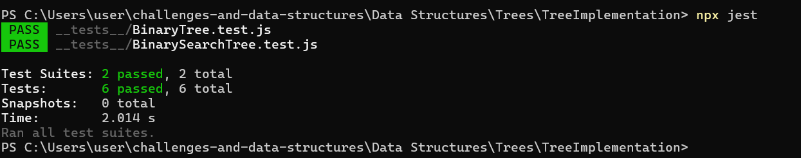

# 🌳 Binary Tree and Binary Search Tree Implementation

## Problem Domain
Implement binary tree traversals (preorder, inorder, postorder) and BST operations (add, contains, remove).

## Example Console Output


## Algorithm
1. Use recursion for traversals.
2. Maintain BST property during insertion and deletion.
3. Return results as arrays.

## Big O
| Operation | Time Complexity | Space Complexity |
|------------|----------------|------------------|
| Add        | O(log n)       | O(1)             |
| Contains   | O(log n)       | O(1)             |
| Remove     | O(log n)       | O(1)             |

## Tests
- ✅ Pre-order, In-order, Post-order traversal
- ✅ Add, Contains, and Remove for BST

---

### 8. Update Table of Contents
In the root README of your repo:

```markdown
- [Binary Tree and Binary Search Tree Implementation](./Data-Structures/Trees/TreeImplementation/README.md)
